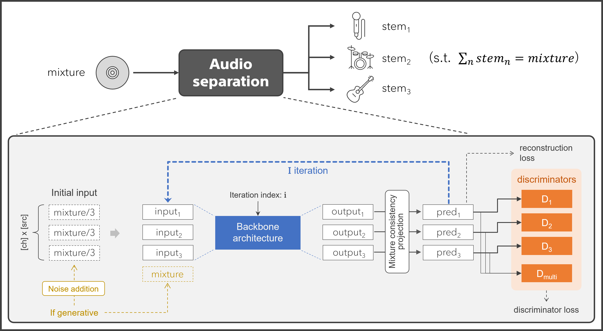

# Iterative Audio Separation with Mixture Consistency via MIMO Model Extension

[](https://sonyresearch.github.io/mimo-audio-separation/)
[](https://arxiv.org/abs/2609.07226)


This is the official PyTorch implementation for "[**Iterative Audio Separation with Mixture Consistency via MIMO Model Extension**](https://arxiv.org/abs/2609.07226)",
which proposes a general framework to convert any single-step audio separation model into an iterative separation process with mixture consistency property.



It supports state-of-the-art music source separation backbones including **BS-RoFormer** [1], **Mel-RoFormer** [2], and **SCNet** [3] using scalable [Hydra](https://hydra.cc/) configurations and PyTorch Distributed Data Parallel (DDP) via [Accelerate](https://huggingface.co/docs/accelerate/).

---

## 🔥 Features

- 🎵 **Flexible Model Backbones**: BS-RoFormer [1], Mel-RoFormer [2], SCNet [3], and custom MIMO architectures.
- 🚀 **Scalable Distributed Training**: DDP multi-GPU / multi-node training powered by Huggingface Accelerate & Hydra.
- 📦 **Pretrained Checkpoints**: Download and use pretrained model weights.
- 📊 **Evaluation Pipeline**: Seamless integration with `museval` and BSSEval metrics for full-track or sliding-window evaluation.

---

## 🤗 Pretrained Checkpoints

Pre-trained model weights used in the paper can be downloaded below.

### Dataset & Evaluation Note
All the models are trained on the MUSDB18-HQ train dataset (44.1 kHz, 16-bit, stereo),
and SDR values listed below are evaluated on the MUSDB18-HQ test set using the `museval` library (median-of-medians),
so they may differ from the values reported in the paper.
For more details on the evaluation methodology used in the paper, please refer to Section 4.1.2.

### 1. BS-RoFormer Variants (2-Source: Vocals & Accompaniment)

#### **Small models (from ablation study) :**
| Model Variant | Params | Input length | Batch Size | Training Steps | museval SDR<br> (Vocals / Accomp) | Download |
| --- | --- | :---: | :---: | :---: | :---: | :---: |
| BS-RoFormer <br> *(variant-1)* | 12.1 M | 4 sec | 96 | 1,000,000 | 9.64 / 16.80 | [Download](https://github.com/SonyResearch/mimo-audio-separation/releases/download/v1.0.0/bsroformer_small.zip) |
| **MIMO BS-RoFormer** <br> *(variant-8)* | 16.3 M | 4 sec | 96 | 1,000,000 | 10.17 / 17.64 | [Download](https://github.com/SonyResearch/mimo-audio-separation/releases/download/v1.0.0/mimo-bsroformer_3iter_small.zip) |

#### **Large models (from vocal-accompaniment separation experiment) :**
| Model Variant | Params | Input length | Batch Size | Training Steps | museval SDR<br> (Vocals / Accomp) | Download |
| --- | --- | :---: | :---: | :---: | :---: | :---: |
| BS-RoFormer | 72.2 M | 8 sec | 96 | 1,000,000 | 11.40 / 18.48 | [Download](https://github.com/SonyResearch/mimo-audio-separation/releases/download/v1.0.0/bsroformer_large.zip) |
| **MIMO BS-RoFormer** | 71.4 M | 8 sec | 96 | 1,000,000 | 11.62 / 19.04 | [Download](https://github.com/SonyResearch/mimo-audio-separation/releases/download/v1.0.0/mimo-bsroformer_3iter_large.zip) |

### 2. SCNet Variants (4-Source: Vocals, Bass, Drums & Other)

#### **Small models (from 4-stem separation experiment) :**
| Model Variant | Params | Input length | Batch Size | Training Steps | museval SDR <br> (Vocals / Bass / Drums / Other) | Download |
| --- | --- | :---: | :---: | :---: | :---: | :---: |
| SCNet | 10.6 M | 11 sec | 48 | 1,500,000 | 9.71 / 9.65 / 10.61 / 7.26 | [Download](https://github.com/SonyResearch/mimo-audio-separation/releases/download/v1.0.0/scnet_small.zip) |
| **MIMO SCNet** | 10.6 M | 11 sec | 48 | 1,500,000 | 9.82 / 10.46 / 10.93 / 7.69 | [Download](https://github.com/SonyResearch/mimo-audio-separation/releases/download/v1.0.0/mimo-scnet_small.zip) |
| **MIMO SCNet (gen)** | 10.6 M | 11 sec | 48 | 1,500,000 | 9.88 / 10.17 / 10.81 / 7.61 | [Download](https://github.com/SonyResearch/mimo-audio-separation/releases/download/v1.0.0/mimo-scnet-gen_small.zip) |

*\* Note: Parameter counts exclude discriminator weights.*

---

## 📑 Documentation Index

Detailed guides are available in the [`docs/`](docs/) directory:

- 🗂️ **[Dataset Preparation Guide](docs/dataset.md)**: Dataset directory layouts, `metadata.csv` generation script (`script/make_musdb_metadata_csv.py`), and Hydra data configurations.
- 🏋️ **[Training Guide](docs/training.md)**: Single-node / Multi-GPU training commands, Hydra parameter overrides, checkpoint resumption, and fine-tuning.
- 🧪 **[Model Unwrapping & Evaluation Guide](docs/evaluation.md)**: Extracting inference model weights from checkpoints (`src/unwrap_model.py`), evaluating test datasets (`src/evaluate.py`), and re-evaluating output directories (`src/evaluate_from_dir.py`).

---

## 🛠️ Environment Setup

Container-based execution using [Singularity](https://docs.sylabs.io/guides/latest/user-guide/) (Apptainer) is recommended to ensure reproducible environments.

### Requirements

- Python 3.10+
- PyTorch 2.5.x + CUDA 12.1
- Singularity / Apptainer

### 1. Build Singularity Image

```bash
cd container
./build_singularity.bash
```

This creates the container file `container/iterative-separation.sif`.

### 2. Configure Weights & Biases Logging

The training code also requires a Weights & Biases account to log the training outputs. 
Please create an account and follow the instruction.

Once you create your WandB account,
you can obtain the API key from https://wandb.ai/authorize after logging in to your account.
And then, the API key can be passed as an environment variable `WANDB_API_KEY` to a training job
for logging training information.

```bash
export WANDB_API_KEY="your_wandb_api_key_here"
```

---

## 🚀 Quick Start

### 1. Dataset Preparation

Organize your dataset into track directories containing individual stem audio files. Optionally, generate a `metadata.csv` file to speed up dataset initialization:

```bash
python script/make_musdb_metadata_csv.py --root-dir /path/to/MUSDB18_HQ/train
```

*For more details on data configuration and stem grouping, see [docs/dataset.md](docs/dataset.md).*

### 2. Training

Launch distributed training using `torchrun` and `src/train.py`:

```bash
singularity exec --nv --pwd ${ROOT_DIR} \
    -B ${ROOT_DIR} -B ${DATASET_DIR} \
    --env HYDRA_FULL_ERROR=1 \
    --env MASTER_PORT=12345 \
    --env WANDB_API_KEY=${WANDB_API_KEY} \
    container/iterative-separation.sif \
torchrun --nproc_per_node gpu \
src/train.py \
    model=bsroformer-2src_base_71M \
    data=musdb18_src-2_sec-8 \
    optimizer=separator_and_disc \
    data.train.audio_modules.musdb18.root_dirs=[/path/to/MUSDB18_HQ/train] \
    trainer.output_dir=/path/to/runs/train/exp001 \
    trainer.batch_size=48 \
    trainer.num_workers=4
```

*For details on checkpoint resumption (`trainer.ckpt_dir`) and fine-tuning, see [docs/training.md](docs/training.md).*

### 3. Model Unwrapping & Evaluation

Unwrap a training checkpoint to extract clean model weights (e.g. from EMA) for inference:

```bash
python src/unwrap_model.py \
    --ckpt-dir /path/to/runs/train/exp001/ckpt_dir/step_0100000 \
    --output-dir /path/to/unwrapped_models/exp001
```

Run evaluation on test data:

```bash
python src/evaluate.py \
    --ckpt-dir /path/to/unwrapped_models/exp001 \
    --iterations 1 2 3 \
    --input-audio-dir /path/to/MUSDB18_HQ/test \
    --stems "vocals" "drums/bass/other" \
    --stem-names "vocals" "accompaniment" \
    --output-dir /path/to/runs/evaluate/exp001 \
    --use-museval \
    --save-audio
```

*For full CLI options and offline metric calculation, see [docs/evaluation.md](docs/evaluation.md).*

### 4. Audio Inference

Run source separation on arbitrary mixture audio files using a trained or unwrapped checkpoint (`src/inference.py`):

```bash
python src/inference.py \
    --ckpt-dir /path/to/unwrapped_models/exp001 \
    --input-audio-dir /path/to/mixtures \
    --output-dir /path/to/output_stems \
    --stem-names vocals accomp \
    --iterations 3
```

*For full CLI options and multi-iteration output configuration, see [docs/inference.md](docs/inference.md).*


---

## 🧩 Applying the MIMO Framework to Your Custom Model

Because the proposed framework is general and architecture-agnostic, you can convert any single-step separation model into an iterative MIMO model in 3 simple steps:

1. **Develop your base model**: Define your standard PyTorch single-step source separation backbone (SISO / SIMO).
2. **Extend the model architecture to MIMO**: Widen input channels to receive $K \times C$ multi-source tensors (where $K$ is the number of stems and $C$ is audio channels), output $K$ stems (or $K \times K$ cross-stem masks), and accept a time-step embedding input `t`. Additionally, if your model is spectral masking-based, you can adopt mask-weighted prediction for the MIMO extension by referring to Section 3.1 of the paper.
3. **Wrap with `MIMOBase`**: Wrap your MIMO backbone using `MIMOBase` (`src/model/mimo_base.py`), which manages multi-step iterative refinement and mixture consistency projection during training and inference.

```python
import torch
import torch.nn as nn
from src.model.mimo_base import MIMOBase

# 1. Base Model
class MyBaseSeparator(nn.Module):
    def __init__(self, in_channels=2, out_channels=2):
        super().__init__()
        self.conv = nn.Conv1d(in_channels, out_channels, kernel_size=3, padding=1)
    def forward(self, x):
        """
        input: (B, C, T)
        output: (B, C, T)
        """
        return self.conv(x)

# 2. MIMO Extension
class MyMIMOSeparator(nn.Module):
    def __init__(self, base_model, num_sources=2, in_channels=2):
        super().__init__()
        self.num_sources = num_sources
        self.in_channels = in_channels
        self.input_layer = nn.Conv1d(num_sources * in_channels, in_channels, kernel_size=1)
        self.base_model = base_model
        self.time_emb = nn.Embedding(num_embeddings=10, embedding_dim=in_channels)

    def forward(self, x, t=None):
        """
        input: (B, K, C, T)
        output: (B, K, C, T)
        """
        B, K, C, T = x.shape
        x_flat = x.view(B, K * C, T)  # Flatten stems into channel dimension
        h = self.input_layer(x_flat)
        if t is not None:
            h = h + self.time_emb(t).unsqueeze(-1)
        out = self.base_model(h)
        return out.view(B, K, C, T)

# 3. Wrap with MIMOBase
mimo_backbone = MyMIMOSeparator(base_model=MyBaseSeparator(), num_sources=2, in_channels=2)

model = MIMOBase(
    num_channels=2,
    num_sources=2,
    backbone_model=mimo_backbone,
    max_iter=3,                 # Number of iterative refinement steps
    model_output_style="direct",  # "direct" or "diff"
    mixture_consistency=True,     # Enforces mixture consistency projection: sum(stems) == mixture
    use_time_emb=True
)

# Forward pass automatically performs I-step iterative refinement with mixture consistency
outputs = model(x_multi_sources, t)
```

---

## Citing

```bibtex
@misc{ikemiya2026mimo,
      title={Iterative Audio Separation with Mixture Consistency via {MIMO} Model Extension},
      author={Yukara Ikemiya and WeiHsiang Liao and Yuki Mitsufuji},
      year={2026},
      eprint={2609.07226},
      archivePrefix={arXiv},
      primaryClass={eess.AS}
}
```

## 📚 References

1. **BS-RoFormer**: "Music Source Separation with Band-Split RoPE Transformer", W.-T. Lu et al., *arXiv:2309.02612*, 2023.
1. **Mel-RoFormer**: "Mel-Band RoFormer for Music Source Separation", J.-C. Wang et al., *arXiv:2310.01809*, 2023.
1. **SCNet**: "SCNet: Sparse Compression Network for Music Source Separation", W. Tong et al., *arXiv:2401.13276*, 2024.

